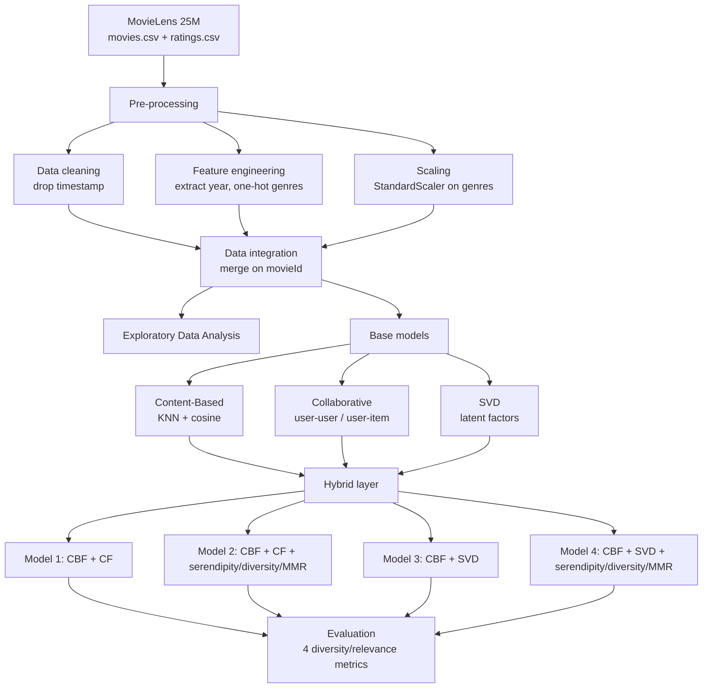

# Mitigating the Echo Chamber Issue in Movie Recommendation Systems

A movie recommender that deliberately balances **relevance** against **diversity** to break users out of the "echo chamber", the loop where a system keeps recommending more of what you've already seen. It combines content-based filtering, collaborative filtering, and Singular Value Decomposition, then layers four hybrid variations that inject serendipity, enforce genre diversity, and re-rank with Maximal Marginal Relevance.

> MSc Data Science dissertation project, University of Surrey. Built on the MovieLens 25M dataset.

---

## Overview

Recommendation systems are very good at giving users more of what they already like, and that is exactly the problem. When a system only ever recommends titles similar to a user's history, it creates an **echo chamber** (or *filter bubble*): the user's exposure narrows, world cinema goes unseen, long-tail titles never surface, and the platform quietly loses the chance to widen engagement.

This project tackles that trade-off head-on. Rather than optimising for accuracy alone, it treats **diversity and novelty as first-class objectives** and asks: can we keep recommendations relevant to a user's taste while still surprising them?

The approach:

- Build three base recommenders : **content-based filtering** (CBF), **collaborative filtering** (CF), and **SVD** each with a known blind spot toward the echo chamber.
- Combine them into **four hybrid variations**, adding three custom mechanisms : `add_serendipity`, `ensure_diversity`, and Maximal Marginal Relevance (`MMR`)  to push diversity without abandoning relevance.
- Evaluate every variation on four metrics that measure both *how relevant* and *how diverse* the output is.

**Headline result:** Hybrid Model 4 (content-based + SVD + all three diversity mechanisms) was the most balanced, genuinely diverse recommendations that still track the user's preferences.

---

## Architecture

The pipeline moves from raw data to evaluated recommendations in five stages:



**Stages**

1. **Pre-processing** : drop the `timestamp` column, extract each film's release **year** from its title, and one-hot encode the pipe-delimited `genres` string into 19 binary columns.
2. **Feature scaling** : standardise the genre features (`StandardScaler`) so distance-based models aren't skewed.
3. **Data integration** : merge the frames on `movieId` (the primary key) so ratings and movie features line up.
4. **Modelling** : three base recommenders plus four hybrids (see below).
5. **Evaluation** : score each hybrid on genre diversity, similarity, novelty, and intra-list similarity.

**The three diversity mechanisms** (used by Hybrid Models 2 and 4):

| Mechanism | What it does | Key parameter |
|---|---|---|
| `add_serendipity` | Swaps a share of recommendations for unexpected titles from outside the candidate set | `serendipity_percentage = 0.2` |
| `ensure_diversity` | Caps any single genre's share of the list | `threshold = 0.7` |
| `MMR` (Maximal Marginal Relevance) | Re-ranks to trade off relevance against dissimilarity to already-picked items | balance parameter `β` |

---

## Data Model

**Dataset:** [MovieLens 25M](https://grouplens.org/datasets/movielens/25m/) — 25M ratings from 162,000 users across 62,000 movies, ratings in 0.5–5.0 half-star steps (released Dec 2019, GroupLens / University of Minnesota).

**Raw entities**

| Source | Key fields |
|---|---|
| `movies.csv` | `movieId`, `title`, `genres` (pipe-delimited) |
| `ratings.csv` | `userId`, `movieId`, `rating`, `timestamp` (dropped) |

**Engineered representations**

| Structure | Shape | Purpose |
|---|---|---|
| `year` | 1 column | Release year parsed from `title`; a light diversity signal |
| One-hot genres | 19 binary columns | `1`/`0` presence per genre, used for similarity |
| Content feature set | genres × **0.8** + year × **0.2** | Weighted so genre dominates, year adds variety |
| `user_movie` matrix | 2,500 × ~2,500 | User ratings for a subset of active users / popular movies |
| `user_similarity_matrix` | 2,500 × 2,500 | Pairwise **cosine similarity** between users |
| SVD factorisation | `A = U Σ Vᵀ` | Low-rank latent factors to predict unseen ratings |

> The 2,500-user subset is deliberate: it drops sparsely-active users (who add noise, not signal) and keeps computation tractable.

---

## Project Structure

> Adjust filenames to match what's actually in your `Code/` folder — this is the recommended layout.

```
.
├── README.md
├── requirements.txt
├── .gitignore
├── report/
│   └── Report_Netflix.pdf          # full dissertation write-up
├── data/                           # NOT committed — see Quick Start to download
│   ├── movies.csv
│   └── ratings.csv
├── notebooks/
│   └── movie_recommender.ipynb     # EDA + modelling + evaluation
├── src/                            # (optional) if you refactor notebook into modules
│   ├── preprocessing.py
│   ├── content_based.py
│   ├── collaborative.py
│   ├── svd_model.py
│   ├── hybrid_models.py
│   └── evaluation.py
└── figures/                        # exported plots used in the report
```

---

## Quick Start

```bash
# 1. Clone
git clone https://github.com/<your-username>/<your-repo>.git
cd <your-repo>

# 2. Create and activate a virtual environment
python -m venv .venv
source .venv/bin/activate          # Windows: .venv\Scripts\activate

# 3. Install dependencies
pip install -r requirements.txt

# 4. Download the dataset (not shipped with the repo)
#    Get MovieLens 25M from https://grouplens.org/datasets/movielens/25m/
#    Unzip movies.csv and ratings.csv into ./data/

# 5. Run
jupyter notebook notebooks/movie_recommender.ipynb
```

A minimal `requirements.txt` for this stack:

```
pandas
numpy
scikit-learn
scipy
matplotlib
seaborn
jupyter
```

*(If your SVD implementation uses the `surprise` library rather than scikit-learn, add `scikit-surprise` and pin versions.)*

---

## Results & Validation

Every hybrid was scored on four metrics. Two reward **relevance** (Similarity, Intra-List Similarity — lower ILS = more internally varied) and two reward **breadth** (Genre Diversity, Novelty).

| Metric | Definition |
|---|---|
| **Genre Diversity** | Spread of genres across the recommended list — higher is more diverse |
| **Similarity** | Jaccard overlap between recommended genres and the input movie's genres |
| **Novelty** | Popularity-based score (rating counts, normalised) — how far the list leans on popular vs long-tail titles |
| **Intra-List Similarity** | Minkowski-based similarity *within* the list — lower means the picks differ more from each other |

**Scores** (input: *Toy Story (1995)*, `userId = 847`):

| Model | Genre Diversity | Similarity | Novelty | Intra-List Similarity |
|---|---|---|---|---|
| Hybrid Model 2 (CBF + CF + logic) | **0.8625** | 0.2513 | 0.1427 | 0.6767 |
| Hybrid Model 3 (CBF + SVD) | 0.4375 | **0.7391** | 0.0289 | 0.6458 |
| Hybrid Model 4 (CBF + SVD + logic) | 0.8500 | 0.4277 | 0.1098 | 0.6551 |

*(Hybrid Model 1 is the naïve CBF+CF baseline and was not scored — it simply concatenates the two base lists.)*

**Reading the results**

- **Model 2** maximises genre diversity, but because its collaborative side is built on a *popular-movie subset*, it leans toward well-known titles rather than the long tail.
- **Model 3** is highly relevant but barely diverse — it mostly returns lookalikes, so it doesn't really break the echo chamber.
- **Model 4** lands in the middle on every axis: strong diversity, meaningful relevance, and better long-tail reach than Model 2. **It was selected as the best-balanced model** — the one that keeps users close to their taste while genuinely widening what they see.

All models share an intra-list similarity of roughly 0.65–0.68, a floor set by the content-based component common to each.

---

## Security & Best Practices

This is a research project, not a deployed service, so "security" here means **responsible data and reproducibility practice**:

- **No large data in git.** The MovieLens files (hundreds of MB) are excluded via `.gitignore`; users download them from the source. This keeps the repo cloneable and under GitHub's 100 MB file limit.
- **Dataset licensing.** MovieLens data is provided by GroupLens under terms that require **attribution** and restrict redistribution and commercial use. Cite the dataset; don't re-host the raw files.
- **No PII.** MovieLens identifies users only by anonymised `userId` — there is no personal data to leak. Confirm this stays true if you ever swap in another source.
- **Reproducibility.** Pin dependency versions in `requirements.txt`, and **set a fixed random seed** wherever randomness is used (notably `add_serendipity`, which randomly swaps in titles) so results are repeatable.
- **No secrets in the repo.** This project needs no API keys or credentials — keep it that way. If you later add any (e.g. a TMDB key for posters), load it from an environment variable and add it to `.gitignore`, never hard-code it.
- **Clean notebooks.** Clear heavy outputs before committing, and keep `.ipynb_checkpoints/` out of the repo (handled in `.gitignore`).

---

## Technologies Demonstrated

**Languages & tooling:** Python, Jupyter

**Libraries:** pandas · NumPy · scikit-learn (K-Nearest Neighbours, `StandardScaler`, cosine similarity) · SciPy · Matplotlib · seaborn
*(SVD via scikit-learn or `scikit-surprise`, depending on implementation.)*

**Techniques & concepts:**

- Content-based filtering with **KNN + cosine similarity** over weighted genre/year features
- Collaborative filtering via **user–user and user–item** similarity matrices
- **Singular Value Decomposition** for latent-factor rating prediction
- **Hybrid recommender design** — combining models to cover each other's weaknesses
- Custom re-ranking: **Maximal Marginal Relevance**, serendipity injection, genre-diversity capping
- Feature engineering (year extraction, one-hot encoding), feature scaling, and data integration
- Recommender evaluation beyond accuracy: **diversity, novelty, serendipity, and intra-list similarity**
- Exploratory data analysis and visual communication of results

---

## Reference

Full methodology, literature review, and analysis are in [`report/Report_Netflix.pdf`](report/Report_Netflix.pdf).

Dataset: F. M. Harper and J. A. Konstan, *The MovieLens Datasets: History and Context.* GroupLens Research, University of Minnesota. https://grouplens.org/datasets/movielens/25m/
